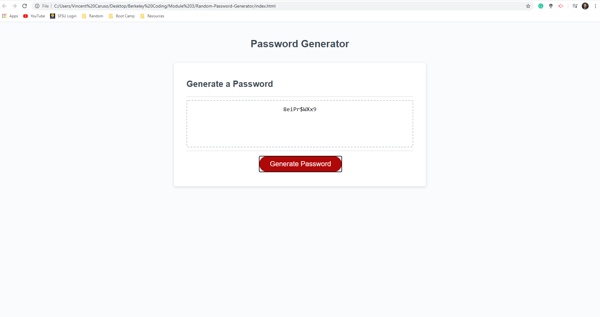

# Javascript Password Generator

## Overview
A tool to randomly generate a password that meets certain criteria,
so that you can create a strong password that provides greater security.

## Link
[Link to the live application](https://vcaruso0923.github.io/Random-Password-Generator/)

## Functionality

1. When you click the button to generate a password,
then you are presented with a series of prompts for password criteria

2. When prompted for password criteria,
then you select which criteria to include in the password

3. When prompted for the length of the password,
then you choose a length of at least 8 characters and no more than 128 characters

4. When prompted for character types to include in the password,
then you choose lowercase, uppercase, numeric, and/or special characters

5. When you answer each prompt,
then your input should be validated and at least one character type must be selected

6. When all prompts are answered,
then a password is generated that matches the selected criteria

7. When the password is generated,
then the password is either displayed in an alert or written to the page

## Screenshot

The following image demonstrates the application functionality:

